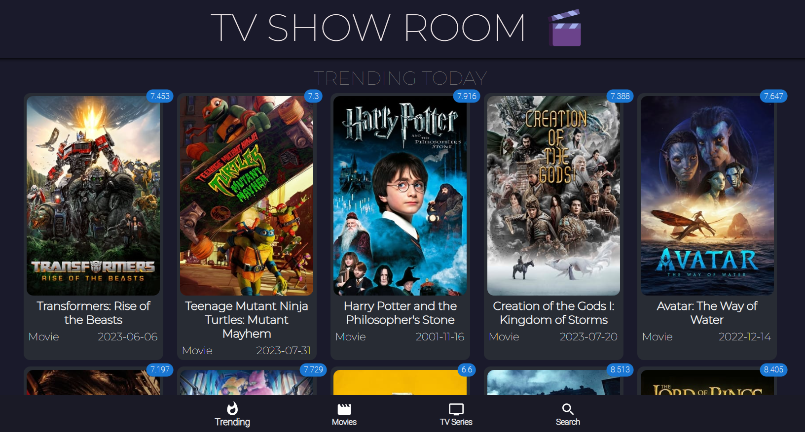
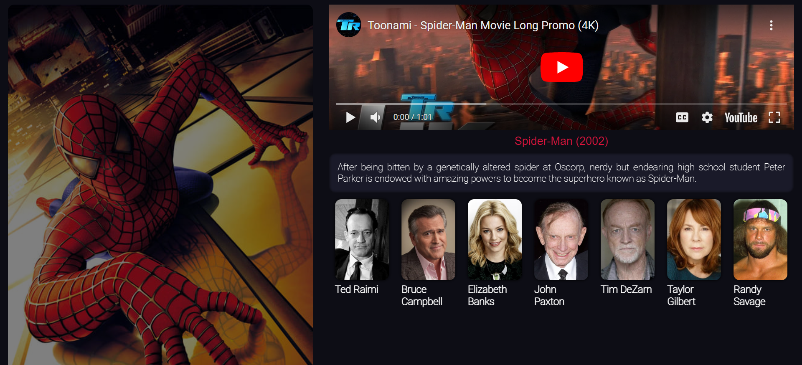
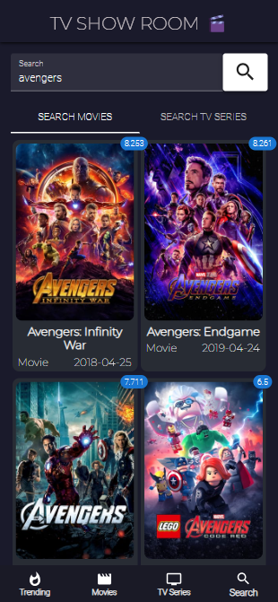

# Movie App with React.js and Material-UI

## Overview

This is a Movie App built with React.js and Material-UI, fetching movie and series data from The Movie Database (TMDb) API. The app allows users to browse and explore a wide range of movies and TV shows, providing details such as titles, descriptions, release dates, rating, and more.







## Features

- **Browse Movies and TV Shows:** Explore a vast collection of movies and TV series.
- **Search Functionality:** Easily search for specific movies or TV shows.
- **Detailed Information:** View detailed information about each movie or TV show, including synopsis, release date, and rating.
- **Responsive Design:** The app is designed to be responsive, providing a seamless experience across different devices.

## Technologies Used

- **React.js:** A JavaScript library for building user interfaces.
- **Material-UI:** A React UI framework that implements Google's Material Design.
- **The Movie Database (TMDb) API:** Used to fetch movie and series data.

## Setup Instructions

1. **Clone the Repository:**
   ```bash
   git clone https://github.com/yourusername/movie-app.git
   cd movie-app
   ```
